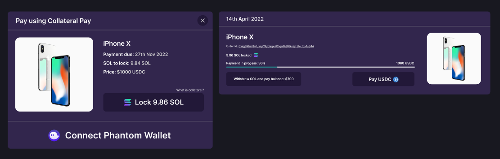

# Solana Payments Adapter

A suite of Solana payment methods. Solana Payment Adapter allows any web application, dosen't matter if it's a web2 or web3 to allow adding variety of payment methods to their app without writing much code!
It also has a built in wallet integration so it just works with non web3 apps!<br>


## Demo
Link to the demo: https://solana-payment-adapter.netlify.app/

## Usage
### Install using yarn
```shell
$ yarn add solana-payment-adapter
```
```ts
import { CollateralPayButton } from "solana-payment-adapter";

const Demo = () => {
  return (
    <CollateralPayButton />
  )
}
```
Note: yarn Package is not yet published, since it's under development!

## Video Demo
Video Link: https://www.youtube.com/watch?v=Ezq5A3NpTaw
